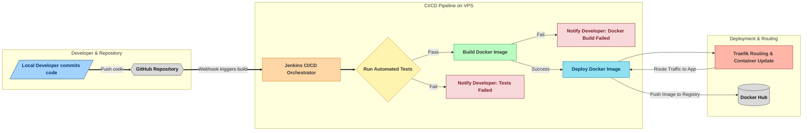

```mermaid
flowchart LR
 subgraph DEV_STAGE["Developer & Repository"]
    direction LR
        DEV[/"Local Developer commits code"/]
        GITHUB{{"GitHub Repository"}}
  end
 subgraph CI_STAGE["CI/CD Pipeline on VPS"]
    direction TB
        JENKINS["Jenkins CI/CD Orchestrator"]
        TESTS{"Run Automated Tests"}
        BUILD["Build Docker Image"]
        TEST_FAIL["Notify Developer: Tests Failed"]
        BUILD_FAIL["Notify Developer: Docker Build Failed"]
        DOCKER["Deploy Docker Image"]
  end
 subgraph DEPLOY_STAGE["Deployment & Routing"]
    direction TB
        TRAEFIK["Traefik Routing & Container Update"]
        DOCKERHUB[("Docker Hub")]
  end
    DEV == Push code ==> GITHUB
    GITHUB == Webhook triggers build ==> JENKINS
    JENKINS ==> TESTS
    TESTS -- Pass --> BUILD
    TESTS -- Fail --> TEST_FAIL
    BUILD -- Success --> DOCKER
    BUILD -- Fail --> BUILD_FAIL
    DOCKER --> TRAEFIK
    DOCKER -- Push Image to Registry --> DOCKERHUB
    TRAEFIK -- Route Traffic to App --> DOCKER
     DEV:::dev
     GITHUB:::repo
     JENKINS:::jenkins
     TESTS:::decision
     BUILD:::build
     TEST_FAIL:::notify
     BUILD_FAIL:::notify
     DOCKER:::docker
     TRAEFIK:::router
     DOCKERHUB:::repo
    classDef dev fill:#a2d2ff,stroke:#003366,color:#003366,font-weight:bold
    classDef repo fill:#d9d9d9,stroke:#444,color:#111,font-weight:bold
    classDef decision fill:#fff3b0,stroke:#c97e12,color:#333,font-weight:bold
    classDef jenkins fill:#ffd6a5,stroke:#c97e12,color:#333,font-weight:bold
    classDef build fill:#b9fbc0,stroke:#259d53,color:#333,font-weight:bold
    classDef docker fill:#90e0ef,stroke:#0077b6,color:#003366,font-weight:bold
    classDef router fill:#ffb5a7,stroke:#b22222,color:#333,font-weight:bold
    classDef notify fill:#f8d7da,stroke:#721c24,color:#721c24,font-weight:bold
```
